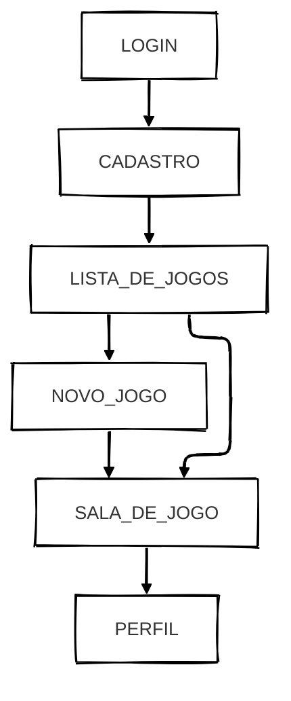
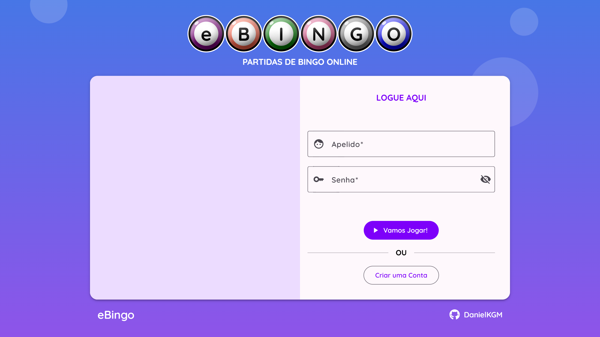
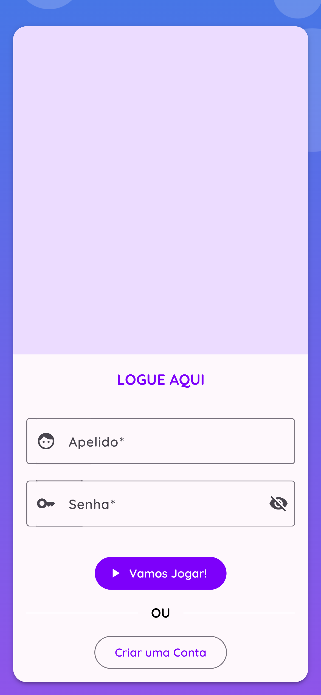
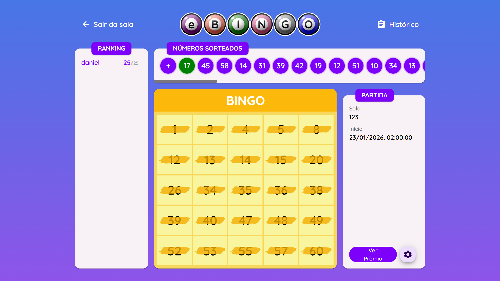
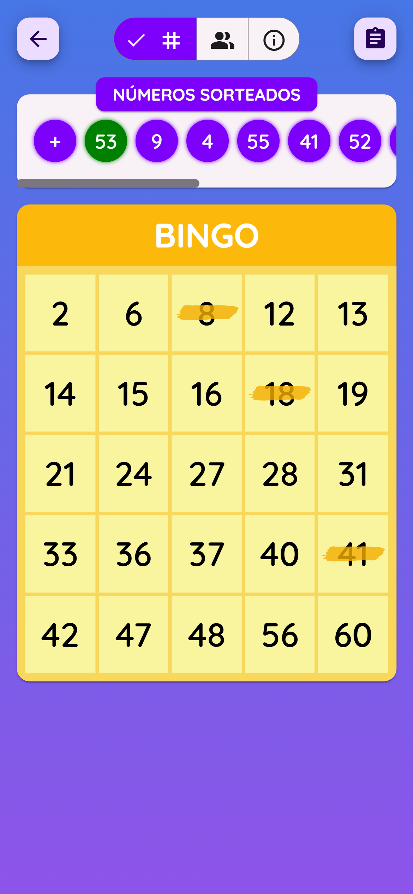

<p align="right"><a id="readme-top" href="https://github.com/DanielKGM/ebingo-backend" target="_blank">Repositório do Back-End (Spring Boot)</a></p>


<p><strong>PARTIDAS DE BINGO ONLINE</strong></p>

**eBingo** é o mínimo produto viável para um <i>website</i> de bingo interativo, onde usuários podem participar de partidas <i>online</i> e em tempo real. Este repositório contem o <i>front-end</i> do projeto.

## Fluxo Geral

O usuário poderá criar sua conta, autenticar-se, procurar por partidas disponíveis, entrar em salas de jogo, gerar sua cartela e competir ou acompanhar o jogo em tempo real, desde que haja um administrador para orquestrar a partida.

Adicionalmente, poderá ganhar **prêmios** (texto exclusivo) e conferir o seu perfil.

## Funcionalidades

- [x] Design responsivo;
- [x] Design minimalista e intuitivo;
- [x] Autenticação e registro de usuários;
- [x] Jogador pode visualizar e editar seu perfil;
- [x] Diferentes Permissões entre usuários comuns e administradores;
- [x] Gerenciamento e criação de jogos pelos administradores;
- [x] Usuários visualizar uma lista de jogos e entrar neles;
- [x] Vencedor de cada jogo tem acesso a um texto exclusivo;
- [x] Sistema exige autenticação para resgatar o prêmio;
- [x] Gerar cartelas de bingo automaticamente para cada jogador;
- [x] Cada jogo terá um ranking em tempo real;
- [x] Sorteio de números pelos administradores e exibição dos resultados para todos os participantes em tempo real;
- [x] O sistema valida automaticamente quando uma cartela completa a sequência vencedora;
- [x] Preenchimento manual e obrigatório das cartelas.
- [x] Filtro por nome e/ou por status na listagem de jogos;
- [x] Usuários podem visualizar a sala sem entrar no jogo;
- [x] Auditoria e histórico do jogo;
- [x] Proteção de rotas.
<p align="right">(<a href="#readme-top">voltar ao topo</a>)</p>

# Estrutura

- `Login`: autenticação dos usuários;
- `Cadastro`: registro de novos usuários;
- `Listagem`: listagem de todos os jogos ou a partir de filtro;
- `Formulário de Jogo`: criar ou editar um jogo (administradores);
- `Sala de jogo`: onde toda dinâmica do Bingo acontece. Os usuários poderão marcar suas cartelas e conferir números sorteados. Haverá também um ranking de jogadores, visualização do prêmio e histórico da partida;
- `Sala de jogo (finalizado)`: ainda é possível visualizar o jogo e seu histórico, mesmo após concluído;
- `Perfil`: informações do usuário, edição de apelido e listagem de prêmios conquistados.

## Diagrama de Fluxo



<p align="right">(<a href="#readme-top">voltar ao topo</a>)</p>

# Capturas de Tela

<center></center> <center> </center><center></center> <center></center>

<p align="right">(<a href="assets">mais capturas de tela</a>)  (<a href="#readme-top">voltar ao topo</a>)</p>

# Tecnologias Utilizadas

## JavaScript

|                                                                                                                                    |    Nome    |
| :--------------------------------------------------------------------------------------------------------------------------------: | :--------: |
|     |  Angular   |
|  | TypeScript |
|         |    npm     |

## Comunicação

|                                                                                                                                   |   Nome    |
| :-------------------------------------------------------------------------------------------------------------------------------: | :-------: |
|  | websocket |
|       |   HTTP    |

## Web Dev

|                                                                                                                                      |     Nome     |
| :----------------------------------------------------------------------------------------------------------------------------------: | :----------: |
|          |     HTML     |
|           |     CSS      |
|          |     Sass     |
|  | Tailwind CSS |

## DevOps

|                                                                                                                                |  Nome  |
| :----------------------------------------------------------------------------------------------------------------------------: | :----: |
|  | Docker |

<p align="right">(<a href="https://github.com/DanielKGM/ebingo-backend/blob/main/pom.xml">pom.xml</a>) (<a href="#readme-top">voltar ao topo</a>)</p>

# Execução do Projeto em Contâiner

## Requisitos

- Baixe o [Git](https://git-scm.com/downloads) e o [Docker Desktop](https://www.docker.com/products/docker-desktop/).

## Passo a Passo

1. Crie uma pasta para o projeto;
2. Dentro dessa pasta, **clone** (ou baixe) os projetos `ebingo-frontend` e `ebingo-backend`, através dos comandos:

```sh
git clone https://github.com/DanielKGM/ebingo-backend
```

```sh
git clone https://github.com/DanielKGM/ebingo-frontend
```

3. Abra o **Docker Desktop**, após algumas configurações básicas exigidas pelo instalador da aplicação;
4. Vá para o diretório do projeto **ebingo-backend** (onde tem o arquivo `compose.yaml`) e execute o seguinte comando:

```sh
docker-compose up --build
```

<p align="right">(<a href="#readme-top">voltar ao topo</a>)</p>
